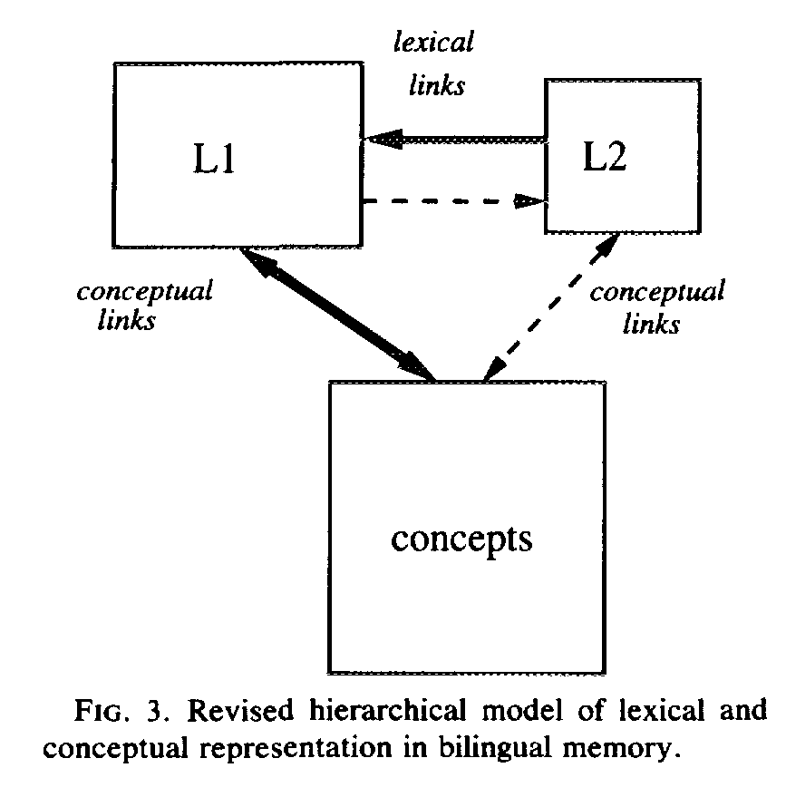

```{r setup, include=FALSE, cache=FALSE, echo=FALSE}
options(tinytex.verbose = TRUE)
knitr::opts_chunk$set(echo = FALSE)
options(scipen = 0, digits = 2) 
#options(tinytex.verbose = TRUE)

rm(list = ls())


library(tidyverse)
library(ggpirate)
library(lme4)
library(lmerTest)
library(effects)
library(yarrr)
library(beanplot)
library(MASS)
library(knitr)
library(papaja)
library(kableExtra)

source("../Write sentences/corpus/bnc_functions.R")


# modified from papaja
prettify_terms <- function(x, standardized = FALSE, centred = TRUE) {
  if(standardized) x <- gsub("scale\\(", "", x)       # Remove scale()
  if(centred) x <- gsub("ctr\\(", "", x)       # Remove ctr()
  x <- gsub(pattern = "\\(|\\)|`|.+\\$", replacement = "", x = x)                 # Remove parentheses and backticks
  x <- gsub('.+\\$|.+\\[\\["|"\\]\\]|.+\\[.*,\\s*"|"\\s*\\]', "", x) # Remove data.frame names
  x <- gsub("\\_|\\.", " ", x)                        # Remove underscores
  x <- gsub("([0-9])+", "", x) 
      # in addition to everything the original prettify_terms does, this also removes any digits from the predictor names (introduced by contr.helmert or similar)
  for (i in 1:length(x)) {
    x2 <- unlist(strsplit(x[i], split = ":"))
    x2 <- capitalize(x2)
    x[i] <- paste(x2, collapse = " by ") #" $\\times$ ")
  }
  x
}

capitalize <- function(x) {
  substring(x, first = 1, last = 1) <- toupper(substring(x, first = 1, last = 1))
  x
}


prepare_lmerTest_summary_for_table <- function(lmm_summary){
  # function to adapt lmerTest summary output into a nice table that can be printed using apa_table()
  
  # adapted from the comment by crsh on Github: https://github.com/crsh/papaja/issues/154#issuecommen*t*-509234855
  
   summary_for_table <- lmm_summary$coefficients %>% 
    as.data.frame %>%
    rename(
      "b" = "Estimate"
      , "SE" = "Std. Error"
      , "df" = "df"
      , "t" = "t value"
      , "p" = "Pr(>|t|)"
    ) %>%
    mutate(
      Effect = prettify_terms(rownames(.))) %>%
      # in addition to everything prettify_terms does, this also removes any digits from the predictor names (introduced by contr.helmert or similar)

    
    printnum(
      digits = c(2, 2, 2, 2, 3, 0)
      , gt1 = c(TRUE, TRUE, TRUE, TRUE, FALSE, FALSE)
      , zero = c(TRUE, TRUE, TRUE, TRUE, FALSE, FALSE)
    ) %>%
    dplyr::select(Effect, "b", "SE", "t", "df", "p")
  return(summary_for_table)
}


ctr <- function(x) scale(x, scale = FALSE)

stim <- read_tsv("stimuli.tsv")
stim$item <- 1:nrow(stim)

cognate_properties <- read_csv("cognates_complete.csv") %>% mutate(Related = tolower(Is_Cognate_EN_PT), `False friend` = tolower(Is_False_Cognate_EN_PT) == "yes")

vocab <- read_csv("vocabulary_tests_English_Spanish.csv")
  
prepare_data_frame <-  function(ixs, absolute_lower_limit = 80, absolute_upper_limit = 1500, relative_limit_sd = 2){
  ixs_new <- ixs %>% left_join(stim, by = "item") %>%
    mutate(word = case_when(cond == 1 | cond == 3 ~ `Target word`,  
                            cond == 2 | cond == 4 ~ `Filler word`)) %>% # make  a column that gives the word in the target position no matter which condition we're in
    left_join(cognate_properties, by = c("word" = "English")) %>%
    left_join(vocab, by = "subj") %>%
    left_join(bnc_aggregate[bnc_aggregate$word %in% .$word,], by = "word", suffix = c("",".BNC")) %>%
    mutate(noise = factor(case_when(
      cond > 2 ~ "Visual noise",
      cond <= 2 ~ "No visual noise"), levels = c("No visual noise", "Visual noise"))
    ) %>%
    mutate(condition = factor(case_when(
      !`False Cognate` & (cond == 1 | cond == 3) ~ "Cognate",
      `False Cognate` & (cond == 1 | cond == 3) ~ "False friend",
      !`False Cognate` & (cond == 2 | cond == 4) ~ "Cognate control",
      `False Cognate` & (cond == 2 | cond == 4) ~ "False friend control"),
        levels = c("Cognate","Cognate control", "False friend", "False friend control"))) %>%
    mutate(filter_absolute = (R2 > absolute_lower_limit) &
             (R2 < absolute_upper_limit)) %>%
    group_by(subj, condition, noise) %>% mutate(filter_subj = 
                                                  (R2 > mean(R2, na.rm = TRUE) - relative_limit_sd*sd(R2, na.rm = TRUE)) &
                                                  (R2 < mean(R2, na.rm = TRUE) + relative_limit_sd*sd(R2, na.rm = TRUE))) %>% 
    group_by(item, condition, noise) %>% mutate(filter_item = 
                                                  (R2 > mean(R2, na.rm = TRUE) - relative_limit_sd*sd(R2, na.rm = TRUE)) &
                                                  (R2 < mean(R2, na.rm = TRUE) + relative_limit_sd*sd(R2, na.rm = TRUE)))

  my_contrasts <- cbind(Cognate_vs_Control = c(-1,1,0,0), Cognate_Control_vs_False_Friend_Control = c(0,-1,0,1),
                          True_Cognate_vs_False_Friend = c(-.5,.5,.5,-.5))
  contrasts(ixs_new$condition) <- zapsmall(t(ginv(my_contrasts)))
  colnames(contrasts(ixs_new$condition)) <- colnames(my_contrasts)
  contrasts(ixs_new$noise) <- contr.helmert


  return(ixs_new)
}

```

```{r read_files, echo=FALSE, include=FALSE, cache=FALSE}

FFD <- read_csv("./IXS/COGFFD.IXS") %>% filter(!is.na(R1)) %>% prepare_data_frame(absolute_upper_limit = 800)

paste0("FFD: Excluded ", sum(!FFD$filter_subj | !FFD$filter_item, na.rm = TRUE)/nrow(FFD) * 100, "%.") %>% cat

FFD <- FFD %>% filter(filter_subj & filter_item) # & filter_absolute)

GD <- read_csv("./IXS/COGGD.IXS") %>% filter(!is.na(R1)) %>% prepare_data_frame(absolute_upper_limit = 1000)

paste0("GD: Excluded ", sum(!GD$filter_subj | !GD$filter_item, na.rm = TRUE)/nrow(GD) * 100, "%.") %>% cat

GD <-  GD %>% filter(filter_subj & filter_item) # & filter_absolute)


TVT <- read_csv("./IXS/COGTVT.IXS") %>% filter(!is.na(R1)) %>% prepare_data_frame(absolute_upper_limit = 1200)

paste0("TVT: Excluded ", sum(!TVT$filter_subj | !TVT$filter_item, na.rm = TRUE)/nrow(TVT) * 100, "%.") %>% cat

TVT <- TVT %>% filter(filter_subj & filter_item) # & filter_absolute)

#GOP <- read_csv("./IXS/COGGOP.IXS") %>% filter(!is.na(R1)) %>% prepare_data_frame()


```

## Introduction

- How do bilinguals represent the words they know in all their languages?
  - One possibility: Two separate lexicons; bilinguals (mostly) access meaning by accessing their L1 (Revised Hierarchical Model, Kroll & Stewart, 1994)
  
## Revised Hierarchical Model  

```{r, out.height = "200px"}

```

(figure from Kroll & Stewart, 1994)

## Introduction

  - Alternative: Lexicons are not separate. Bilinguals can activate all their lexical representations at any time. Task demands determine which words are responded to (BIA+, Dijkstra & van Heuven, 2002)

## Bilingual Interactive Activation+ model

```{r, out.height = "200px"}
knitr::include_graphics("bia.pdf")
```

(figure from Dijkstra & van Heuven, 2002)

## Past results

- From behavioural studies: 
  - not much evidence for separate lexicons and selective access 
    - Cognate facilitation effects: e.g. for EN and ES/PT bilingual speakers: "error" processed faster than "mistake"
    - Interlingual homographs ("false friends") cause interference: e.g. "sensible" vs. "sensitive" for EN and ES/PT speakers
  - This suggests there are more direct connections between L2 words and meaning than there should be according to the Revised Hierarchical Model


## Past eye movement results

- Libben & Titone (2009): Cognates facilitate processing and interlingual homographs (false friends) interfere with processing in both early and late L2 reading measures compared to control words
- Cognates processed faster in L2 reading (Cop, Dirix, Van Assche, Drieghe, Duyck, 2017) compared to control words
 
  
## It's not just monolingual vs. bilingual

- In many parts of the world, multilingualism is the norm
- The Revised Hierarchical Model cannot properly account for multilingualism
  - How would it work? L3 -> L2 -> L1 -> Concepts?
- The BIA+ could be extended more easily: just add more words and additional language nodes

## Predictions from an extended BIA+ model

- Multilingual cognates should be processed faster than bilingual cognates (activation from more orthography nodes)
- Multilingual "false friends" (i.e. a letter string that is a cognate in two languages but not in the third, e.g. "sensible" in ES/PT vs. EN) should generate more interference than bilingual "false friends".
 - Toassi, Mota, & Teixera (2017): Effect of triple cognates (Portuguese/Italian/German). Trilinguals process triple cognates faster than double cognates

## Current study
- Following up on Toassi, Mota, & Teixera (2017)
- Additional questions: 
  - Is the cognate effect stronger in the presence of visual noise (more top-down processing?)
    - In other words, is it easier to process a cognate in the presence of visual noise than a control word?
  - For triple cognates, does it help you if you are good at all three languages or are two sufficient for the cognate effect?
  
## Method
- Participants: 41 Portuguese-Spanish-English trilinguals in Ceará, Brazil reading 100 *English* (L3) sentences with embedded cognates/false friends or control words
- Target words: 50 true cognates, 50 false friends
- All false friends with English were true cognates between Spanish and Portuguese
- Visual noise manipulation

## Example cognates

```{r stimuli,results = "as.is", echo = FALSE}
cognate_examples <- rbind(cognate_properties %>% filter(Related == "yes") %>% filter(!`False friend`) %>% head, cognate_properties %>% filter(Related == "yes") %>% filter(`False friend`) %>% head) %>% mutate(`False friend` = if_else(`False friend`, "yes", "no"))

cognate_examples %>% dplyr::select(English, starts_with("Similar_word"), freq_per_million.x, `False friend`) %>% kable(booktabs = T,
                                linesep = c('', '', '', '','', '\\addlinespace'), # longer space after 5 entries
                                    col.names = c("English", "Portuguese", "Spanish", "English word frequency (per million)", "False friend")) %>% kable_styling(latex_options = c("scale_down"))
```

## Example experimental stimuli

```{r example_sentences_experimental, echo = FALSE}
examples <- rbind(stim %>% filter(!`False Cognate`) %>% head, stim %>% filter(`False Cognate`) %>% head)

examples %>%
  dplyr::select(experimental_sentence, `False Cognate`) %>%
  kable(booktabs = T,
linesep = c('', '', '', '','', '\\addlinespace'), # longer space after 5 entries
col.names = c("Cognate/False friend condition", "False friend?")) %>% kable_styling(latex_options = c("scale_down"), font_size = 24) %>% column_spec(c(1,2), width_min = "10em")
```

## Example control stimuli

```{r example_sentences_filler, echo = FALSE}

examples %>%
  dplyr::select(filler_sentence, `False Cognate`) %>%
  kable(booktabs = T,
linesep = c('', '', '', '','', '\\addlinespace'), # longer space after 5 entries
col.names = c("Control condition", "False friend?")) %>% kable_styling(latex_options = c("scale_down"), font_size = 24) %>% column_spec(c(1,2), width_min = "10em")
```


## Hypotheses
- If lexical access occurs across languages (as suggested in BIA+):
    - Target words that are more _visually familiar_ (cognates/false friends) should be processed *faster* than those that are _less familiar_ (control words)
- If processing is influenced by the degree of _semantic overlap_ (or lack thereof):
    - Target words that are _false friends_ should be *more difficult (slower)* to process than target words that are _true cognates_ 
- If the presence of visual noise leads to more top-down processing and reliance on memory:
  - The effects of _visual familiarity_ and of _semantic overlap_ should be *stronger* in the presence of _visual noise_.
- If there is a greater _advantage for triple cognates_ and a greater disadvantage for "double false friends":
  - Participants who are _strong in all three languages_ should show a *greater advantage for cognates* and a *greater disadvantage for false friends* than those who are strong in only one of the languages 
    

## Results: First fixation duration

```{r FFD, cache=FALSE}
noise.labs <- c("Visual noise", "No visual noise")
names(noise.labs) <- c("noise", "no_noise")

fc.labs <- c("True cognate", "False friend")
names(fc.labs) <- c("FALSE", "TRUE")


#pirateplot(R2 ~ control, data = FFD %>% filter(!(subj %in% c(16,34,40))))

ggplot(FFD %>% filter(!(subj %in% c(16,34,40))), aes(y = R2, x = condition, colour = condition)) + facet_wrap(. ~ noise) + geom_pirate(points_params = list(shape = 19, alpha = 0.1), bars_params = list(alpha = .1)) + ylab("First fixation duration (in ms)")+ theme_apa() + theme(text = element_text(size=12),
        axis.text.x = element_text(angle=15, hjust=1)) 

#beanplot(R2 ~ control, data = FFD %>% filter(!(subj %in% c(16,34,40))), beanlinewd = .1, log="",col="bisque", method="jitter", ylim = c(0, 900))

```

## Results: Total viewing time

```{r TVT, cache = FALSE}

ggplot(TVT %>% filter(!(subj %in% c(16,34,40))), aes(y = R2, x = condition, colour = condition)) + facet_wrap(. ~ noise) + geom_pirate(points_params = list(shape = 19, alpha = 0.1), bars_params = list(alpha = .1)) + ylab("Total viewing time (in ms)")+ theme_apa() + theme(text = element_text(size=12),
        axis.text.x = element_text(angle=15, hjust=1)) 

```

## Hypotheses revisited: Part 1
- Target words that are _visually familiar (cognates/false friends)_ are indeed processed *faster* than those that are _less familiar (control words)_ in both early and late measures
- _Semantic overlap effects_ (false friend interference) *do not occur in the early measure of FFD*
- _Visual noise_ *slows down processing in general*, but it *doesn't* seem to *increase top-down* reliance on lexical memory

## Participant proficiency

```{r proficiency, cache = FALSE}
with(filter(vocab) %>% mutate(exclude = if_else(spanish < .15 & english < .15, "red","black")), qplot(english, spanish,  label = subj, colour = exclude) + scale_color_manual(values = c("black", "red")) + geom_text(nudge_y = .03)) + xlab("English proficiency (proportion correct)") + ylab("Spanish proficiency (proportion correct)") + theme(legend.position = "none") 
```

We excluded participants 16, 34, 40 because of very low English and Spanish proficiency

## Effect of English proficiency: Total viewing time
```{r tvtlmm_plot, results="asis", cacher = FALSE}
TVT.lmm.pf <- lmer(data = TVT %>% filter(!(subj %in% c(16,34,40))), formula = log(R2) ~  condition * ctr(english) * ctr(spanish) * noise + (1|subj) + (1|item))

ef <- Effect(c("english", "condition"), TVT.lmm.pf)
plot(ef, type = "response", axes=list(y=list(transform=exp, lab="Total viewing time"), xlab = "English proficiency (proportion correct)"), lines=list(multiline=TRUE), confint=list(style="auto"))
```


## Hypotheses revisited: Part 3

- Readers who are highly proficient in English *indeed show* much faster processing overall
- *However,* highly proficient English readers show a much larger difference between true cognates and false friends in later reading measures than English readers with low proficiency
- *No effect* of Spanish proficiency (in general or on false friends)

## Conclusions

- Trilinguals' performance when reading triple cognates seems to be mostly influenced by their _proficiency_ in the _language they are reading_, not their other non-native language.
- In early processing and for low proficiency readers, visual familiarity (across languages) seems to be most important
- For highly proficient readers, _semantic overlap_  becomes much more important in later processing
- Visual noise has an overall effect but does not seem to affect cognate facilitation or false friend interference.

## Thank you very much.

- Muchas gracias.
- Muito obrigado.
- *Merci beaucoup.*
- Questions? Preguntas? Perguntas?


## Results: Gaze duration

```{r GD, cache = FALSE}

ggplot(GD %>% filter(!(subj %in% c(16,34,40))), aes(y = R2, x = condition, colour = condition)) + facet_wrap(. ~ noise) + geom_pirate(points_params = list(shape = 19, alpha = 0.1), bars_params = list(alpha = .1)) + ylab("Gaze duration (in ms)")+ theme_apa()+ theme(text = element_text(size=12),
        axis.text.x = element_text(angle=15, hjust=1)) 

```


##  Effect of cognate condition and noise: First fixation duration (target word) 
```{r ffdlmm, results="asis", cache=FALSE}
FFD.lmm <- lmer(data = FFD %>% filter(!(subj %in% c(16,34,40))), formula = log(R2) ~ condition*noise + (1|subj) + (1|item))
summary(FFD.lmm) %>% prepare_lmerTest_summary_for_table() %>% kable(booktabs = TRUE, align = "r") %>% kable_styling(latex_options = c("scale_down")) 
```

## Effect of cognate condition and noise: Gaze duration (target word)  
```{r gdlmm, results="as.is", cache=FALSE}
GD.lmm <- lmer(data = GD %>% filter(!(subj %in% c(16,34,40))), formula = log(R2) ~ condition*noise + (1|subj) + (1|item))
summary(GD.lmm) %>% prepare_lmerTest_summary_for_table() %>% kable(booktabs = TRUE, align = "r") %>% kable_styling(latex_options = c("scale_down")) 
```

## Effect of cognate condition and noise: Total viewing time (target word) 
```{r tvtlmm, results="as.is", cache=FALSE}
TVT.lmm <- lmer(data = TVT %>% filter(!(subj %in% c(16,34,40))), formula = log(R2) ~ condition*noise  + (1|subj) + (1|item))
summary(TVT.lmm) %>% prepare_lmerTest_summary_for_table() %>% kable(booktabs = TRUE, align = "r") %>% kable_styling(latex_options = c("scale_down")) 
```


##  Proficiency effects: First fixation duration (target word) 
```{r ffdlmm_pf1, results="asis", cache=FALSE}
FFD.lmm.pf <- lmer(data = FFD %>% filter(!(subj %in% c(16,34,40))), formula = log(R2) ~ condition * ctr(english) * ctr(spanish) * noise + (1|subj) + (1|item))
summary(FFD.lmm.pf) %>% prepare_lmerTest_summary_for_table() %>% head(16) %>% kable(booktabs = TRUE, align = "r") %>% kable_styling(latex_options = c("scale_down"), font_size = 8) 
```

## Effect of proficiency: First fixation duration (continued)
```{r ffdlmm_pf2, results="as.is", cache=FALSE}
# model is fitted in the block with the effects plot above
summary(FFD.lmm.pf) %>% prepare_lmerTest_summary_for_table() %>% tail(-16, addrownums = FALSE) %>% kable(booktabs = TRUE, align = "r") %>% kable_styling(latex_options = c("scale_down"), font_size = 8) 
```


## Effect of proficiency: Gaze duration (target word)  
```{r gdlmm_pf1, results="as.is", cache=FALSE}
GD.lmm.pf <- lmer(data = GD %>% filter(!(subj %in% c(16,34,40))), formula = log(R2) ~  condition * ctr(english) * ctr(spanish) * noise + (1|subj) + (1|item))
summary(GD.lmm.pf) %>% prepare_lmerTest_summary_for_table() %>% head(16) %>% kable(booktabs = TRUE, align = "r") %>% kable_styling(latex_options = c("scale_down"), font_size = 8) 
```

## Effect of proficiency: Gaze duration (continued)
```{r gdlmm_pf2, results="as.is", cache=FALSE}
# model is fitted in the block with the effects plot above
summary(GD.lmm.pf) %>% prepare_lmerTest_summary_for_table() %>% tail(-16, addrownums = FALSE) %>% kable(booktabs = TRUE, align = "r") %>% kable_styling(latex_options = c("scale_down"), font_size = 8) 
```

## Effect of proficiency: Total viewing time (target word) 
```{r tvtlmm_pf1, results="as.is", cache=FALSE}
# model is fitted in the block with the effects plot above
summary(TVT.lmm.pf) %>% prepare_lmerTest_summary_for_table() %>% head(16) %>% kable(booktabs = TRUE, align = "r") %>% kable_styling(latex_options = c("scale_down"), font_size = 8) 
```

## Effect of proficiency: Total viewing time (continued)
```{r tvtlmm_pf2, results="as.is", cache=FALSE}
TVT.lmm.pf <- lmer(data = TVT %>% filter(!(subj %in% c(16,34,40))), formula = log(R2) ~  condition * ctr(english) * ctr(spanish) * noise + (1|subj) + (1|item))
# model is fitted in the block with the effects plot above
summary(TVT.lmm.pf) %>% prepare_lmerTest_summary_for_table() %>% tail(-16, addrownums = FALSE) %>% kable(booktabs = TRUE, align = "r") %>% kable_styling(latex_options = c("scale_down"), font_size = 8) 
```

## Effect of Spanish proficiency: Total viewing time
```{r tvtlmm_plot_spanish, results="as.is", cache = FALSE}
ef <- Effect(c("spanish", "condition"), TVT.lmm.pf)
plot(ef, type = "rescale", axes=list(y=list(transform=exp, lab="Total viewing time")), lines=list(multiline=TRUE), confint=list(style="auto"))
```

## Open questions

- Knowing Spanish does not seem to add much in terms of cognate facilitation with English when you already know Portuguese
  - Is this true for other language combinations? For example, would an English native speaker benefit more from knowing Spanish when reading in Portuguese?
- False friends may cause more trouble in language production than in comprehension. Will knowing an additional language help or hurt you in production?
- Is there a trilingual advantage in other cognitive tasks? 